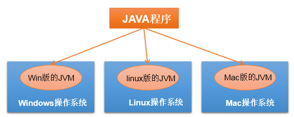
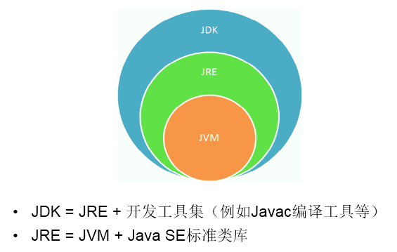
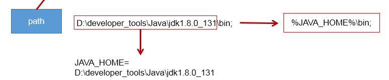
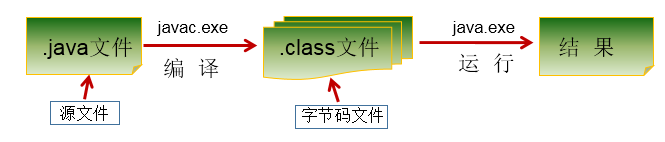
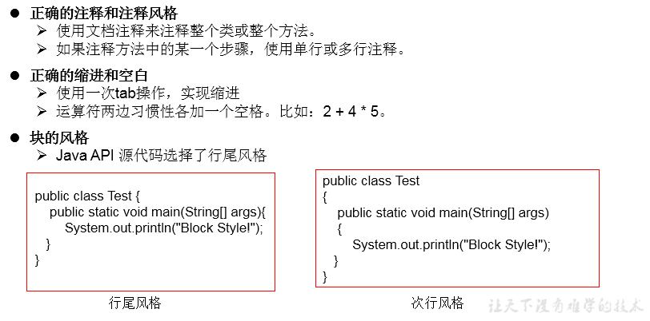

# 1 java语言概述

## 1、常用dos命令

> dir   :   列出当前目录下的文件以及文件夹
>
> md  :   创建目录
>
> rd   ：  删除目录
>
> cd   ：  进入到指定目录
>
> cd..  :    退到上一级目录
>
> cd\  :    退到根目录
>
> del  :     删除文件
>
> exit ：   退出dos命令行
>
> echo  ：输入字符串

## 2、java语言的特点

> 面向对象：
>
> ​		两个要素： 类、对象
>
> ​		三个特征： 封装、继承、多态
>
> 健壮性
>
> * 去除了c语言中的指针
> * 自动垃圾回收机制 --> 仍然会出现内存溢出、内存泄漏
>
> 跨平台性：write once,run anywhere :  一次编译，到处运行
>
> 功劳归功于：JVM 
>
> 
>
> 

## 3.开发环境的搭建

### 3.1JDK、JRE、JVM的关系



### 3.2 JDK的下载、安装

> 下载：官网，github
>
> 安装：傻瓜式安装：JDK、JRE

### 3.3path环境变量的配置

> 1. 为什么配置path环境变量 ？
>
>    path：环境变量：windows操作系统执行命令时所要搜寻的路径
>
>    原因： 希望java的开发工具（ java.exe ,  javac.exe )在任何文件路径下都可以执行
>
> 2. 如何配置 ？
>
> 3. 

## 4、第一个java程序

### 4.1 开发体验--helloworld

```java
class HelloChina{
	public static void main(String[] args){
		System.out.println("Hello,World!");
	}
}
```



编译：javac HelloWorld.java

运行： java HelloChina

### 4.2总结第一个程序

>1. java程序编写-编译-运行的过程
>  编写：我们将编写的java代码保存在以".java"结尾的源文件中
>  编译：使用javac.exe命令编译我们的java源文件。格式：javac 源文件名.java
>  运行：使用java.exe命令解释运行我们的字节码文件。 格式：java 类名
>
>  
>
>2. 在一个java源文件中可以声明多个class。但是，只能最多有一个类声明为public的。
>  而且要求声明为public的类的类名必须与源文件名相同。
>
>  
>
>3. 程序的入口是main()方法。格式是固定的。
>
>   
>
>4. 输出语句：
>  System.out.println():先输出数据，然后换行
>  System.out.print():只输出数据
>
>  
>
>5. 每一行执行语句都以";"结束。
>
>  
>
>6. 编译的过程：编译以后，会生成一个或多个字节码文件。字节码文件的文件名与java源文件中的类名相同。

## 5、注释与API文档等

### 1.注释:Comment

>分类：
>单行注释：//
>多行注释：/*    */
>文档注释：/**    */
>
>作用：
>① 对所写的程序进行解释说明，增强可读性。方便自己，方便别人
>② 调试所写的代码
>
>特点：
>①单行注释和多行注释，注释了的内容不参与编译。
>  换句话说，编译以后生成的.class结尾的字节码文件中不包含注释掉的信息
>② 注释内容可以被JDK提供的工具 javadoc 所解析，生成一套以网页文件形式体现的该程序的说明文档。
>③ 多行注释不可以嵌套使用

### 2、Java API 文档：

>API:application programming interface。习惯上：将语言提供的类库，都称为api.
>API文档：针对于提供的类库如何使用，给的一个说明书。类似于《新华字典》

### 3.良好的编程风格		




