[TOC]

# 2基本语法

## 1 关键字与标识符

### 1.1 java关键字的使用

定义：被Java语言赋予了特殊含义，用做专门用途的字符串（单词）

特点：关键字中所字母都为小写

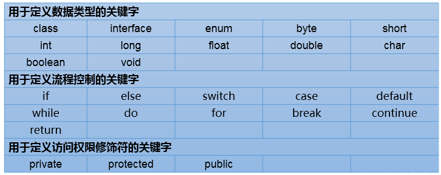

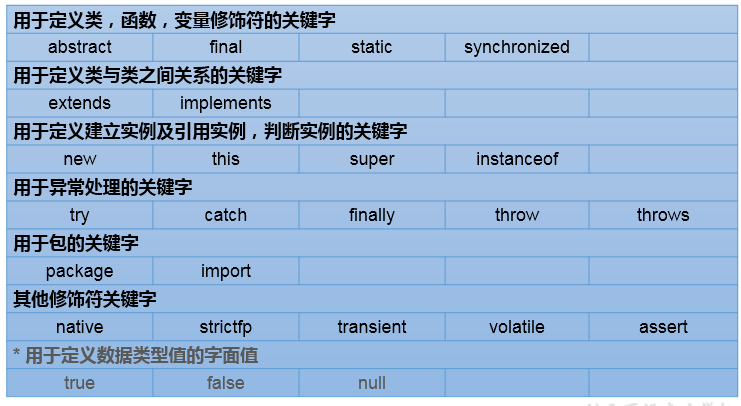

### 1.2注意

保留字：现Java版本尚未使用，但以后版本可能会作为关键字使用。
具体哪些保留字：goto 、const
注意：自己命名标识符时要避免使用这些保留字

### 1.3标识符的使用

定义：凡是自己可以起名字的地方都叫==标识符==。
涉及到的结构：
包名、类名、接口名、变量名、方法名、常量名
==规则：(必须要遵守。否则，编译不通过)==

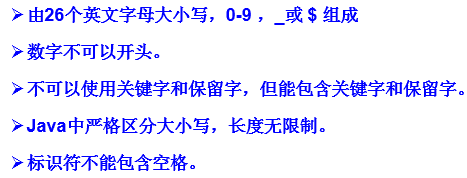

==规范：（可以不遵守，不影响编译和运行。但是要求大家遵守）==

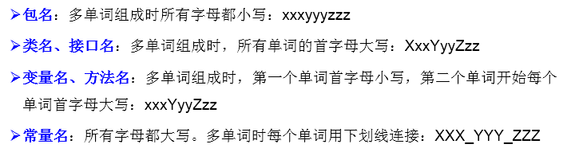

## 2.代码简洁之道

### 有意义的命名

2.1 介绍

软件中随处可见命名。我们给变量、函数、参数、类和包命名。我们给源代码及源代码所在目录命名。
这么多命名要做，不妨做好它。下文列出了取个好名字的几条简单规则。

2.2 名副其实,见名知意

​     变量名太随意，haha、list1、ok、theList 这些都没啥意义

2.3 避免误导

​     包含List、import、java等类名、关键字或特殊字；
​     字母o与数字0，字母l与数字1等
​     提防使用不同之处较小的名称。比如：XYZControllerForEfficientHandlingOfStrings与XYZControllerForEfficientStorageOfStrings

2.4 做有意义的区分

​     反面教材，变量名：a1、a2、a3
​     避免冗余，不要出现Variable、表字段中避免出现table、字符串避免出现nameString，直接name就行，知道是字符串类型
​     再比如：定义了两个类：Customer类和CustomerObject类，如何区分？
​	     定义了三个方法：getActiveAccount()、getActiveAccounts()、getActiveAccountInfo()，如何区分？

2.5 使用读得出来的名称

​     不要使用自己拼凑出来的单词，比如：xsxm(学生姓名)；genymdhms(生成日期，年、月、日、时、分、秒)
​     所谓的驼峰命名法，尽量使用完整的单词

2.6 使用可搜索的名称

​     一些常量，最好不直接使用数字，而指定一个变量名，这个变量名可以便于搜索到.
​     比如：找MAX_CLASSES_PER_STUDENT很容易，但想找数字7就麻烦了。

2.7 避免使用编码

​     2.7.1 匈牙利语标记法
​           即变量名表明该变量数据类型的小写字母开始。例如，szCmdLine的前缀sz表示“以零结束的字符串”。
​     2.7.2 成员前缀
​          避免使用前缀，但是Android中一个比较好的喜欢用m表示私有等，个人感觉比较好
​     2.7.3 接口和实现
​          作者不喜欢把接口使用I来开头，实现也希望只是在后面添加Imp

2.8 避免思维映射

​     比如传统上惯用单字母名称做循环计数器。所以就不要给一些非计数器的变量命名为：i、j、k等

2.9  类名

​     类名与对象名应该是名词与名词短语。如Customer、WikiPage、Account和AddressParser。避免使用Data或Info这样的类名。
​     不能使动词。比如：Manage、Process

2.10 方法名
     方法名应当是动词或者动词短语。如postPayment、deletePage或save

2.11 别扮可爱
     有的变量名叫haha、banana
     别用eatMyShorts()表示abort()

2.12 每个概念对应一个词
     项目中同时出现controllers与managers，为什么不统一使用其中一种？
     对于那些会用到你代码的程序员，一以贯之的命名法简直就是天降福音。

2.13 别用双关语
     有时可能使用add并不合适，比例insert、append。add表示完整的新添加的含义。     

2.14 使用解决方案领域名称
     看代码的都是程序员，所以尽量用那些计算机科学术语、算法名、模式名、数学术语，
     依据问题所涉领域来命名不算是聪明的做法。

2.15 使用源自所涉问题领域的名称
     如果不能用程序员熟悉的术语来给手头的工作命名，就采用从所涉问题领域而来的名称吧。
     至少，负责维护代码的程序员就能去请教领域专家了。

2.16 添加有意义的语境
     可以把相关的变量放到一个类中，使用这个类来表明语境。

2.17 不要添加没用的语境
     名字中带有项目的缩写，这样完全没有必要。比如有一个名为“加油站豪华版”（Gas Station Deluxe）的项目，
     在其中给每个类添加GSD前缀就不是什么好策略。

2.18 最后的话
     取好名字最难的地方在于需要良好的描述技巧和共有文化背景。

## 3.变量的分类

### 3.1 按数据类型分类

详细说明：
//1. 整型：byte(1字节=8bit) \ short(2字节) \ int(4字节) \ long(8字节)
		//① byte范围：-128 ~ 127
	// ② 声明long型变量，必须以"l"或"L"结尾
		// ③ 通常，定义整型变量时，使用int型。
       //④整型的常量，默认类型是：int型
//2. 浮点型：float(4字节) \ double(8字节)
		//① 浮点型，表示带小数点的数值
		//② float表示数值的范围比long还大
	//③ 定义float类型变量时，变量要以"f"或"F"结尾
	//④ 通常，定义浮点型变量时，使用double型。
	//⑤ 浮点型的常量，默认类型为：double
//3. 字符型：char (1字符=2字节)
		//① 定义char型变量，通常使用一对'',内部只能写一个字符
	//② 表示方式：1.声明一个字符 2.转义字符 3.直接使用 Unicode 值来表示字符型常量
//4.布尔型：boolean
	//① 只能取两个值之一：true 、 false
	//② 常常在条件判断、循环结构中使用
1.2 按声明的位置分类(了解)

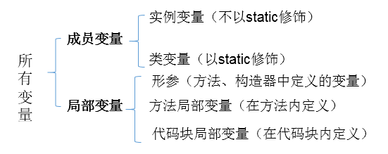

### 3.2定义变量的格式：

数据类型  变量名 = 变量值;
或
数据类型  变量名;
变量名 = 变量值;

### 3.3变量使用的注意点：

   ① 变量必须先声明，后使用
   ② 变量都定义在其作用域内。在作用域内，它是有效的。换句话说，出了作用域，就失效了
   ③ 同一个作用域内，不可以声明两个同名的变量

### 3.4基本数据类型变量间运算规则

​	1 涉及到的基本数据类型：除了boolean之外的其他7种
​	2 自动类型转换(只涉及7种基本数据类型）
结论：当容量小的数据类型的变量与容量大的数据类型的变量做运算时，结果自动提升为容量大的数据类型。
​	==byte 、char 、short --> int --> long --> float --> double==
​	特别的：当byte、char、short三种类型的变量做运算时，结果为int型
说明：此时的容量大小指的是，表示数的范围的大和小。比如：==float容量要大于long的容量==

​	3 强制类型转换(只涉及7种基本数据类型）：自动类型提升运算的逆运算。
​		==1.需要使用强转符：()==
​		2.注意点：强制类型转换，可能导致精度损失。
​	4 String与8种基本数据类型间的运算

​		1.String属于引用数据类型,翻译为：字符串

​		2.声明String类型变量时，使用一对""

​		3.String可以和8种基本数据类型变量做运算，且运算只能是连接运算：+

​		4.运算的结果仍然是String类型
​		避免：
​		String s = 123;//编译错误
​		String s1 = "123";
​		int i = (int)s1;//编译错误

## 4.进制

### 4.1 编程中涉及的进制及表示方式：

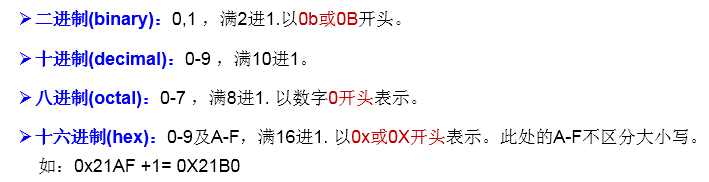

### 4.2二进制的使用说明：

​	1 计算机底层的存储方式：所有数字在计算机底层都以二进制形式存在。
​	2 二进制数据的存储方式：所有的数值，不管正负，底层都以==补码==的方式存储。
​	3 原码、反码、补码的说明：
正数：==三码合一==
负数：

==真值：-10110==

==原码：110110==

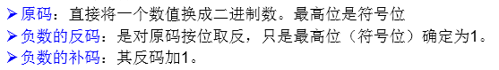

### 4.3进制间的转换：

​	1 图示：

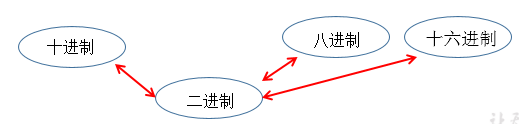

​	2 图示二进制转换为十进制：

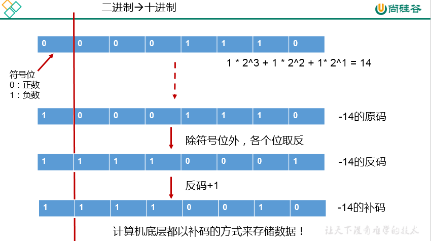

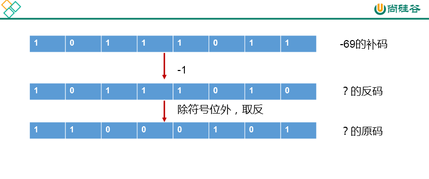

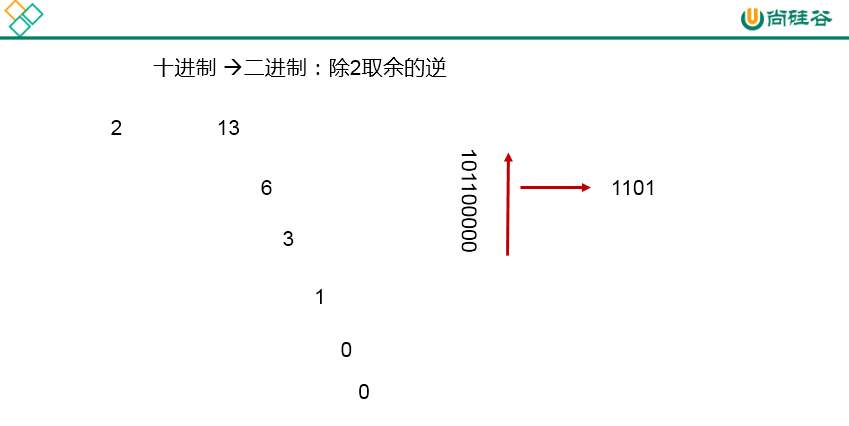

​	3 二进制与八进制、十六进制间的转换：

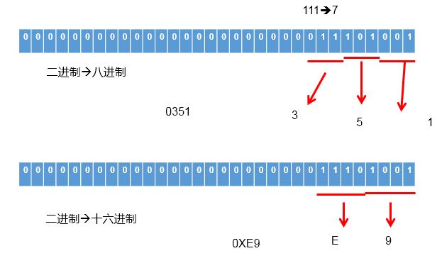

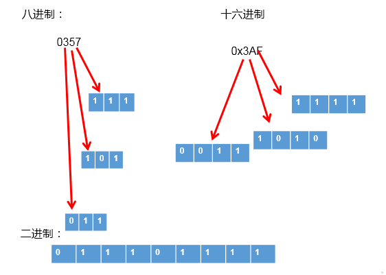