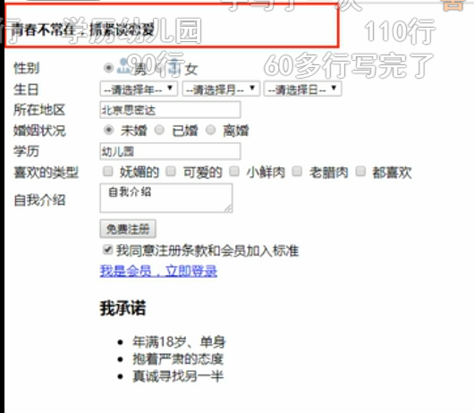

[TOC]

# HTML（超文本标记语言）

2022.6.16

## 1.HTML语法规范

> 1.1 基本语法hello221概述
>
> 双标签 <html> </html>; 单标签<br />
>
> 1.2 标签关系：包含关系和并列关系

## 2.基本结构标签

```html
<!DOCTYPE html>
<html lang="en">     //告诉浏览器这是是一个英文网站，language选择en，edge浏览器会跳出来是否需要翻译网					 //页，中文网页提倡使用zh-CN来做
<head>
    <meta charset="UTF-8">
    <meta http-equiv="X-UA-Compatible" content="IE=edge">
    <meta name="viewport" content="width=device-width,initial-scale=1.0">
    <title> Document </title>        //网页名称
<html>                              // 根标签
	<head>
		<title>我的第一个页面<title/> 
	<head/>	
	<body>
		having a nice day!
	<body/>
<html/>    
	
```

## 3.HTML常用标签

```html
<h1></h1>   - <h6></h6>                            //标题标签,独占一行
<p></p>											 //段落标签
<br /> 										     //换行标签，break
<div></div>				        //没有语义，division，分割、分区，独占一行
<span></span>				   //没有语义，span意为跨度、跨距，一行可以放多个span

```

**文本格式化标签**

|  语义  |             标签             |        说明        |
| :----: | :--------------------------: | :----------------: |
|  加粗  | <strong><strong/>或者<b><b/> | 前者标签加粗，下同 |
|  倾斜  |     <em><em/>或者<i><i/>     |                    |
| 删除线 |    <del><del/>或者<s><s/>    |                    |
| 下滑线 |    <ins><ins>或者<u><u/>     |                    |

**图像标签**

```html
          
//图像标签,定义HTML页面中的图像，src是标签的必须属性，指定图像文件							 
//路径和文件名
注意：html的转义符号
&apos;是单引号的转义符，&quot;是双引号的转义符
```

| 属性   | 属性值   | 说明                                 |
| ------ | -------- | ------------------------------------ |
| src    | 图片路径 | 必须属性                             |
| alt    | 文本     | 替换文本，图像不能显示式的文字       |
| title  | 文本     | 提示文本，鼠标放到图像上，显示的文字 |
| width  | 像素     | 设置图像的宽度                       |
| height | 像素     | 设置图像的高度                       |
| border | 像素     | 设置图像的边框粗细                   |

> 路径：(知识铺垫)
>
> (1)目录文件夹和根目录
>
> 目录文件夹：就是普通文件夹，里面放了我们作业面所需要的相关素材，比如html文件、图片等。
>
> 根目录：打开目录文件夹的第一层就是根目录。
>
> （2）相对路径和绝对路径
>
> 相对路径：以引用图片的html文件所在位置为参考基础，而建立出的目录路径。图片相对于html页面的位置
>
> 同一级：无
>
> ```
> 
> ```
>
> 下一级：/  
>
> ```
> 
> ```
>
> 上一级：../
>
> ```
> 
> ```
>
> 绝对路径：通常是从盘符开始的。注意路径中的分隔符是 \ ，网址除外!

**超链接标签(anchor:锚)**

```html
链接分类

一般链接
<a href="跳转目标" target="目标窗口的弹出方式"> 文本或图像或音频视屏等浏览器直接解析的内容</a>           
//target指定链接页面的打开方式，其中_self为默认值，_blank为在新窗口中打开方式。

空链接
<a href="#">首页</a>  //没有确定链接时可以使用空连接

下载链接
<a href="img.zip">下载文件</a>   //地址链接的是 .exe文件或者是zip等压缩包文件

网络元素链接：在网页中的各种元素如文本，图像，表格，音频和视频等都可以添加超链接。
<a href="http://www.baidu.com">  </a>

锚点链接
点击链接，可以迅速定位到页面的某个位置，具体分两步骤
1、在链接文本的href属性中，设置属性值为#名字的形式，如<a href="#two">第二季</a>
2、找到目标位置标签，里面添加一个id属性=刚才的名字，如<h3 id="two">第二季</h3>

```

注释和特殊字符

> | 特殊字符 | 描述      | 字符的代码     |
> | -------- | --------- | -------------- |
> |          | 空格符    | `&nbsp;`&nbsp; |
> | <        | 小于号    | `&lt;`         |
> | >        | 大于号    | `&gt;`         |
> | &        | 和号      | `&amp;`        |
> | ￥       | 人民币    | `&yen;`        |
> |          | 版权      | `&copy;`       |
> |          | 注册商标  | `&reg;`        |
> |          | 摄氏度    | `&deg;`        |
> | +-       | 正负号    | `&plusmn;`     |
> | x        | 乘号      | `&times;`      |
> |          | 除号      | `&divide;`     |
> |          | 平方上标2 | `&sup2;`       |
> |          | 立方上标3 | `&sup3;`       |
>
> 

**表格标签**

表格单元格中可以放置图片或者链接等等。

1、基本语法

```html
<table align="center" border="1">
    <thead>
          <tr>
        <th>姓名</th>    //表头单元格标签,加粗居中显示   (table head缩写 )
    </tr>  
    </thead>
    <tbody>
         <tr>
        <td>单元格内的文字</td>  //<td>标签必须嵌套在<tr>标签中
    </tr>         //<tr>标签定义表格的行
    </tbody>
   
</table>        
```

为了更好的区分表格结构，使用`<thead>`和`<tbody>`来区分表格结构

2、基本属性

属性名有align：center/left/right、border:1或“”，1表示有边框，后者表示没有边框，等等。

3、合并单元格

跨行合并： rowspan="合并单元格的个数"

跨列合并：colspan=“合并单元格的个数”

```
<td colspan="2"> <td>
tip：合并单元格后一般需要删除多余单元格

```

列表标签

1、无序列表

`<ul>`只能在里边放置`<li>`标签

```html
<ul>
   <li></li>
   .....
</ul>
```

2、有序列表

同样的，`<ol>`标签中只能嵌套`<li>`标签

```html
<ol>
    <li></li>
    <li></li>
    .....
</ol>     
```

3、自定义列表（重点）

`<dl>`标签中用于定义描述列表，与`<dt>`(定义项目、名字）和`<dd>`(描述每一个项目、名字)一起使用，

同样的`<dl></dl>`里面只能包含`<dt>和<dd>`

```html
<dl>
    <dt>名词1</dt>
    <dd>名词解释1</dd>
    <dd>名词解释2</dd>
</dl>
```

4、表单标签

使用目的：收集用户信息

由表单域、表单控件和提示信息3个部分组成

4.1表单域

```html
<form action="url地址" method="提交方式" name=“表单域名称”> //
</form>
```

4.2表单控件

input，单标签 ,type用来指定不同的控件类型 name和value是每个表单元素都有的属性值，主要给后台人员使用

重要：**单选按钮和复选框要有相同的name的值**

```html
<form>
<input type="属性值" />
    示例：
 <input type="text" name="username" value="请输入用户名" maxlength="6">
 <input type="radio" name="sex" checked="checked" value="男">
 <input type="radio" name="sex" value="女">
 <input type="submit" value="免费注册" >
tpye的取值如下
"text"   ，文本,用户可以输入任何文字
"password",密码框
"radio",单选按钮
"checkbox"，复选框
"file",输入字段和浏览按钮，供文件上传
"hidden",定义隐藏的输入字段
"image"，定义图像形式的提交按钮
"reset",定义重置按钮，重置会清除表单中的所有数据
"submit",定义提交按钮，会把表单数据发送到服务器
"button",定义可点击按钮，一般是需要做什么事情，搭配js使用，（注意区别于submit）
</form>
```

input的其它属性值：

| 属性      | 属性值  | 描述                              |
| --------- | ------- | --------------------------------- |
| name      |         | 定义input元素名称                 |
| value     |         | 规定input元素的值                 |
| checked   | checked | 规定input元素首次加载时应当被选中 |
| maxlength | 正整数  | 规定输入字段中的字符的最大长度    |


select标签，下拉表单元素

```html
<body>
    <form>
    籍贯：
    <select>
        <option>山东</option>
        <option>北京</option>
        <option>天津</option>
        <option>火星</option>
    </select>
    </form>
</body>
select中至少包含一对<option>
在<option>中定义selected="selected"时，当前项即为默认选中项。
```


textarea标签，文本域元素

定义多行文本输入的控件

```html
<form>
    今日反馈:
    <textarea cols="50" rows="5"> // cols显示每行中的字符数，
        				//rows显示的行数，实际开发中并不会使用这两个属性         
        pink老师，我知道这个反馈留言是textarea来做的
    </textarea>
</form>
```


`<label>`标签

标签用于绑定一个表单元素，当点击`<label>`标签内的文本时，浏览器会自动将焦点（光标）转到或者选择对应的表单元素上来增加用户体验。

```html
<label for="sex" >男 </label>
<input type="radio" name="sex" id="sex"/>
上述for和id的属性内容必须一致！
```


综合示例：要点：使用表格标签使得表单各项整齐排列，(写的时候可以设置border为1，写完再取消)




```html
<form>
    <h4> 青春不常在，抓紧谈恋爱</h4>
    <table  width="500" border="1">
        //第一行
        <tr>
            <td>性别：</td>
            <td>
                <input type="radio" name="sex"> <label> 男</label>
                <input type="radio" name="sex"> 女
            </td>
        </tr> 
        //第二行
         <tr>
               <td>生日：</td>
               <td>
                   <select>
                       <option>--请选择年份--</option>
                       <option>2001</option>
                        .....
                    </select>
                </td>   
                <td>
                    <select>
                        <option>--请选择月份--</option>
                        <option>2001</option>
                        .....
                    </select>
                </td>   
          </tr>
        //第三行
        <tr>
            <td>所在地区</td>
            <td> <input type="text" value="北京思密达"></td>    
        </tr>
        //第四行
        <tr>
            <td>婚姻状况：</td>
            <td>
                <input type="raido" name="married">结婚 <input type="raido" name="married" checked="checked">未婚
            </td>
        </tr>
    </table>  
</form>
```

> 查阅文档：
>
> w3c：http://www.w3school.com.cn/
