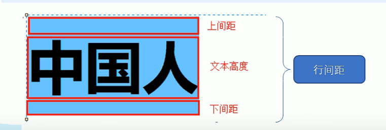

# CSS(层叠样式表)

[TOC]

2022.7.29

## 1、css简介

主要用于设置html页面中的文本内容（字体、大小、对齐方式等）、图片的外形（宽高、边框样式、边距等）以及版面的布局和外观显示样式。

## 2、css语法规范

```html
<head>
	<style>
    /* 选择器 {样式}*/
    p {
    	color: red;
        font-size:12px;
        
    
    }
    
	</style>
</head>

<body>
    <p> 有点意思</p>
</body>
```

## 3、css基础选择器

基础选择器：单个选择器

包括标签选择器、类选择器、id选择器、和通配符选择器。

### 3.1类选择器（可以给一个标签指定多个类名）

多类名的使用方式

(1) 在标签class属性中写多个类名

(2)多个类名中间必须使用空格分开

```html
.red{

}
<div class="red font20"> 亚瑟</div>
```

### 3.2id选择器

与类选择器的区别：只能调用一次，别人切勿使用。

```html
#id名{
	属性1:属性值1;
}
<div id=""></div>
```

### 3.3通配符选择器

选取页面中的所有标签。

```html
*{
	属性1：属性值1;
}
```

### 4、css字体属性

### 4.1字体类型设置

css字体用于定义字体系列、大小、粗细和文字样式。

```html
p{ font-family:"微软雅黑";}
div {font-family:Arial,"Microsoft Yahei","微软雅黑";} //多个字体是给浏览器从前往后选择已安装的字体显示
常见的字体：
body{
font-family:'Microsoft YaHei',tahoma,arial,'Hiragino Sans GB';
}
```

各种字体之间不需使用英文字体的逗号隔开；

一般情况下，如果有空格隔开的多个单词组成的字体，加引号。

### 4.2字体大小

css使用font-size属性定义字体大小。谷歌浏览器默认文字大小为16px；

```html
p{
font-size: 20px;
}
```

### 4.3字体粗细

```html
p{
font-weight:400;  //数值后面不需要跟单位
//font-weight:normal; 400和normal 两者等价，表示不加粗，加粗用bold(700)来表示。
}
```

### 4.4文字样式

```html
p{
font-style: normal;
}
//normal为默认值，标准字体样式，italic为斜体
```

### 4.5字体复合属性

简写的方式

```html
语法规范，顺序不可改变,必须保留font-size和font-family属性
div{
	font: font-style font-weight font-size/line-height font-family;
}
div{
	font:italic 700 16px/20px  'Microsoft yahei';
}

```

## 5、css文本属性

### 5.1文本颜色

```html
div{
color: red;
}
预定义颜色的值：red，green，blue
十六进制：#FF0000，#FF6600，#29D794
RGB代码： rgb(255,0,0)或rgb（100%，0%，0%）
```

### 5.2对齐文本

```html
div{
 text-align: center; //居中对齐 
//left 左对齐
//right
}
```

### 5.3装饰文本

```html
div{
	text-decoration:underline;
//overline（上划线）,none,line-through(删除线)
}
```

### 5.4文本缩进

用来指定文本的第一行的缩进

```html
div{
  text-indent: 2em;  （em element）
//一个相对单位，就是当前元素（font-size）1个文字的大小，如果当前元素没有设置大小，则会按照父元素的1个文字大小。
}
```

### 5.5行间距

line-height用于设置行间的距离(行高)，可以控制文字行行之间的距离。

行高=上间距+文本高度+下间距

```html
p{
	line-height: 26px;
}
```



## 6、css引入方式

### 6.1内部样式表

使用`<style></style>`标签，一般放在文档的`<head>`标签中

### 6.2行内样式表

style是标签的属性

```
<div style="color: red;font-size: 12px;">青春不常在</div>
```

### 6.3外部样式表

1、新建.css的文件

2、使用`<link>`标签

```html
<link rel="stylesheet" href="css文件路径">
//rel的属性值为stylesheet表示为外部样式表。
```


### 