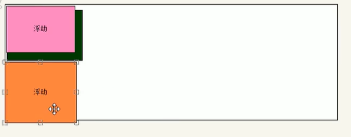
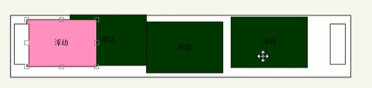

# css2

[TOC]

## 1、Emmet语法

vscode快速生成html标签、css样式、格式化代码

## 2、复合选择器

由两个或多个基础选择器通过不同的方式组合而成的，常用的复合选择器包括：

后代选择器、子选择器、并集选择器、伪类选择器等等。

### 2.1后代选择器

选择元素1里面的所有元素2

```html
元素1 元素2 { 样式声明}
ul li{ 样式声明 }
```

### 2.2子选择器

子选择器只能选择某元素的所有一级子元素

```
元素1 > 元素2{样式声明}
```

### 2.3并集选择器

选择多组标签，通过英文逗号连接而成，逗号可以理解为和的意思。

tip：最后一个选择不需要添加逗号

```
元素1,元素2{样式声明}
ul,div {样式声明}
```

### 2.4伪类选择器

使用：表示，比如：hover、：first-child

因为伪类选择器很多，有链接伪类、结构伪类等。

链接伪类选择器

```html
a:link /* 选择所有未被访问的链接
a:visited /*选择所有已被访问的链接
a:hover   /*选择鼠标指针位于其上的链接
a:active /*选择活动链接（鼠标按下未弹起的链接）

开发中常用写法示例：
a{
	color:gray;
}

a:hover{
	color:red;
}


```

伪类选择器

：focus 伪类选择器用于选取获得焦点的表单元素

焦点就是光标，一般情况下`<input>`类表单元素才能获取，因此这个选择器主要针对于表单元素来说。

```
input:focus{
	background-color:yellow;
}
```

## 3、元素显示模式

元素显示模式就是元素标签以什么方式进行显示，比如`<div>`自己独占一行，比如一行可以方多个`<span>`

html元素一般分为块元素和行内元素两种。

### 3.1块级元素

常见的块元素有`<h1>~<h6>、<p>、<div>、<ul>、<ol>、<li>`等，其中`<div>`标签是最典型的块元素。

块元素的特点：

1、独占一行；

2、高度、宽度、外边距以及内边距都可以控制

3、宽度默认是容器（父级宽度）的100%

4、是一个容器及盒子，里面可以放行内元素或者块级元素。

注意：

1、文字类的元素内不能使用块级元素

2、`<p>`标签主要用于存放文字，不能放块级元素，不能放`<div>`标签

3、`<h1>~<h6>`都是文字类的块级标签，里面也不能放其他块级元素

### 3.2行内元素

`<a>、<strong>、<b>、<em>、<i>、<del>、<ins>、<u>、<span>、<s>`其中

`<span>标签是最典型的行内元素，也叫内联元素。`

行内元素的特点：

1、相邻行内元素在一行上，一行可以显示多个

2、高、宽直接设置是无效的

3、默认宽度就是它本身内容的宽度

4、行内元素只能容纳文本或其他行内元素

注意：

1、`<a>`链接里面不能再放链接

2、特殊情况链接`<a>`里面可以放块级元素，但是`<a>`转换一下块级模式最安全。

### 3.3行内块元素

在行内元素中有几个特殊的标签`、<input />、<td>`，它们同时具有块元素和行内元素的特点。有些资料称它们为行内块元素。

1、和相邻行内元素在一行上，但他们之间会有空白缝隙，一行可以显示多个（行内元素特点）

2、默认宽度就是它本身内容的宽度（行内元素特点）。

3、高度，行高，外边距以及内边距都可以控制（块级元素特点）。

### 3.4显示模式的转换

1、转换为块元素：display：block;

2、转换为行内元素 display：inline;

3、转换为行内块：display：inline-block；

一个小技巧 让单行文字垂直居中：

解决方案：让文字的行高等于盒子的高度，就可以让文字在当前盒子内垂直居中

## 4、css的背景

### 4.1背景颜色

background-color：transparent    //(透明)，也是默认值；

### 4.2背景图片：

background-image：none或者url(地址 )  //none表示无背景图片,记住不要落下url()

```html
background-image:url(images/logo.png)
```

### 4.3背景平铺：

```html
background-repeat:repeat|no-repeat|repeat-x|repeat-y
后两个属性是背景图片横向平铺/纵向平铺

//页面元素既可以添加背景颜色也可以添加背景图片 只不过背景图片会压住背景颜色
```

### 4.4背景图片的位置

利用background-position可以

```
background-position：x y;

参数代表的意思：x坐标和y坐标，可以使用方位名词或者精确单位
精确单位： 百分数 或者  有浮点数字和单位标识符组成的长度值
方位   ：  top|center|bottom|left|center|right   

div{
	background-position: center right;
	//等价于background-position: right center;
}

```

注意点：

1、如果两个值都是方位名词，这两个值前后顺序无关

2、如果只指定了一个方位名词，另一个值省略，则第二个值默认居中对齐

3、如果只指定一个数值，那该数值一定是默认垂直居中

4、数值是图像到盒子左边和上边的距离

参数值除了是方位名词和精确单位，也可以是混合单位；

4.5背景图像固定（背景附着）

background-attachment属性设置背景图像是否固定或者随着页面的其余部分滚动

后期可以制作是差滚动的效果

```
background-attachment: scroll或者 fixed
默认值为scroll，背景图像是随着对象内容滚动

```

### 4.5复合写法

```html
background: black url(images/bd.jpg) no-repeat fixed center top;
```

### 4.6背景半透明

```html
background:rgba(0,0,0,0.3);
最后一个参数是alpha透明度，取值范围在0~1之间。
```

## 5、css的三大特性

### 5.1层叠性

1、样式冲突，遵循就近原则

2、样式不冲突，不会层叠。

### 5.2继承性

子标签会继承父标签中的某些样式，如文本颜色和字号。恰当使用可以简化css代码的复杂性。

子元素可以继承父元素的样式text-，font-，line-这些元素的开头的可以继承，以及color属性。

行高的继承性

```html
<head>
   <style>
    body {
        color: pink;
        /*font: 12px/24px 'Microsoft YaHei';*/
        font: 12px/1.5 'Microsoft YaHei';   
    }
       div{
           //子元素继承了父元素body行高为文字大小1.5倍的这一属性，
           //当前元素文字大小14px的1.5倍,所以当前div的行高也就是21像素;
           font-size: 14px; 
       } 
       li {
           
       }//没有指定文字大小 则会继承父亲的文字大小，body 12px 所以li的行高为12*1.5=18
</style> 
</head>
<body>
    <div>
        粉红色的回忆
    </div>
    <p>
        粉红色的回忆
    </p>
    <ul>
        <li>我没有指定文字大小</li>
    </ul>
</body>

```

body行高1.5 好处在于里面的子元素可以根据自己文字大小自动调整行高

### 5.3优先级

当同一个元素指定多个选择器，就会有优先级的产生

选择器相同，则执行层叠性

选择器不同，则根据选择器权重执行

| 选择器               | 选择器权重 |
| -------------------- | ---------- |
| 继承 或者*           | 0,0,0,0    |
| 元素选择器           | 0,0,0,1    |
| 类选择器，伪类选择器 | 0,0,1,0    |
| ID选择器             | 0,1,0，0   |
| 行内样式style=""     | 1,0,0,0    |
| !important 重要的    | 无穷大     |

```html
div{
color: pink!important;
}
```


```html
<head>
    <style>
        #father{
            color: red;
        }
        p{
            color: pink;
        }
    </style>
</head>
<body>
    <div id="father">
        <p>
            你还是很好看
        </p>
    </div>
</body>
结果为pink色，因为继承的权重为0
```

权重叠加： 示例代码如下

复合选择器会有权重叠加的问题

权重虽然会叠加，但永远不会有进位的问题

例如：十个标签选择器叠加结果为0,0,0,1 +...    0,0,0,10

```html
<head>
    <style>
        li{
            color: red;
        }
        ul li{        
            color:green;   
        }
    </style>
</head>
<body>
    <ul>
        <li>11</li>
        <li>22</li>
        <li>33</li>
    </ul>
</body>

```

## 6、盒子模型

页面布局三大核心：盒子模型，浮动和定位


### 1、边框

border：border-width || border-style || border-color

```html
div{
    border-width: 5px;
    border-style:solid;
    border-color:red;
}
边框的复合写法:
div{
 border: 1px solid red; 没有顺序
}
边框分开写法：
border-top: 1px solid red; //只设定上边框 其余同理
```

表格的细线边框：

```html
border-collapse: collapse;
//表示相邻的边框合并在一起
```

边框会影响盒子实际大小

1测量盒子大小时不量边框

2测量的时候包含了边框，则需要width/height减去边框宽度

### 2、内边距padding

用于设置内边距，即边框与内容之间的距离。padding影响盒子的大小。

padding-bottom

复合写法：

```html
padding:5px; 		1个值，代表上下左右都有5像素内边距
padding:5px 10px; 	2个值，代表上下内边距是5像素，左右内边距是10像素；
padding：5px 10px 20px；	   3个值，代表上内边距5像素，左右内边距10像素 下内边距20像素
padding：5px 10px 20px 30px；4个值，上是5像素 右10像素 下20像素 左30像素 顺时针
```

如果盒子本身没有指定width、height属性，则此时padding不会撑开盒子大小。

```html
div{
	width:100%;
	width:300px;
	height:100px;
	background-color:purple;
}
div p {
	padding:30px;
	background-color:skyblue;
}
<body>
    <div>
        <p>
            
        </p>
    </div>
</body>
这里p标签的大小为300*60像素，若指定了p标签的宽度，则会撑开盒子。
未指定宽度情况下，块级元素的宽度与父亲盒子宽一致

```


### 3、外边距（margin）

margin-bottom等等

margin的简写方式与padding一致

### 3.1外边距典型应用

外边距可以让块级盒子水平居中，但需要满足两个条件：

1、盒子必须制定了宽度

2、盒子左右的外边距都设置为auto

注意：以上方法是让块级元素水平居中，行内元素或者行内块元素水平局长给其父元素添加text-align：center即可。(可将行内元素和行内块元素视为文字？)

### 3.2、外边距合并

3.2.1相邻块元素垂直外边距的合并

> 当上下相邻的两个块元素（兄弟关系）相遇是，如果上面的元素有下外边距margin-bottom，下面的元素有上外边距margin-top，则他们之间的垂直间距不是margin-bottom与margin-top之和，而是取两个值中的较大者。
>
> 解决方案：尽量只给一个盒子添加margin值。


3.2.2嵌套块元素垂直外边距的塌陷

> 对于两个嵌套关系（父子关系）的块元素，父元素有上边距同时子元素也有上边距，此时父元素会塌陷较大的外边距值。（父元素好像塌下来了一样）


解决方案：

1、可以为父元素定义上边框 border：1px solid transparent；

2、可以为父元素定义上内边距

3、可以为父元素添加overflow：hidden；

还有其他方法，比如浮动、固定、绝对定位的盒子不会有塌陷的问题

### 4、清除内外边距

网页元素很多都带有默认的内外边距，而不同的浏览器默认的也不一致，因此在布局钱，首先要清除下网页元素的内外边距。

```html
*{
	padding：0; 
	margin: 0;
}
这也是css的第一行代码
```


注意：行内元素为了照顾兼容性，尽量只设置左右内外边距，不要设置上下内外边距，(设置了也不显示)，但是转换为块级和行内块元素就可以了。

### 5、圆角边框

radius半径原理：椭圆与边框的交集形成圆角的效果

```html
border-radius:lenth;
```

### 6、盒子阴影

```html
box-shadow: h-shadow v-shadow blur spread color inset;
左到右依次是：
水平阴影位置（必须，允许负值），
垂直阴影位置（必须，允许负值）
模糊距离
阴影的尺寸
阴影的颜色
将外部阴影改为内部阴影
```

### 7、文字阴影

```
text-shadow: h-shadow v-shadow blur  color ;
左到右依次是：
水平阴影位置（必须，允许负值），
垂直阴影位置（必须，允许负值）
模糊距离
阴影的颜色

```

## 7、css浮动

网页布局的本质--用css来摆放盒子。

css提供了三种传统布局方式：普通、浮动、定位

普通（标准流）：标签按照规定好默认方式排列

1、块级元素会独占一行，从上向下顺序排列

常用元素：div、hr 、p、h1~h6、ul、ol、dl、form、table

2、行内元素会按照顺序，从左到右排列，碰到父元素边缘则自动换行

常用元素：span、a、i、em等

### 7.1浮动简介

浮动可以改变元素标签默认的排列方式，最典型的应用：可以让多个块级元素一行内排列显示。

网页布局的准则：多个块级元素纵向排列找标准流，多个块级元素横向排列找浮动。

float属性用于创建浮动框，将其移动到一边，直到左边缘或右边缘触及包含块或另一个浮动框的边缘。

```
选择器{
	float:属性值;
}
none,不浮动，默认值
left，元素左浮动
right，元素右浮动

```

### 7.2浮动特性

1、浮动元素会脱离标准流，不再保留原先的 位置（可以想象浮动是往屏幕前飘）

2、浮动的元素会一行内显示并且元素顶部对齐

3、浮动的元素会具有行内块元素的特性

如果行内元素有了浮动，则不需要转换块级、行内块元素就可以直接给高度和宽度。


**浮动元素经常和标准流父级盒子搭配使用**

```html
<style>
    .box{
        width:200px;
        height:400px;
        background-color:pink;
        margin:0 auto;
        
    }
    .left{
        width:230px;
        height:460px;
        background-color:purple;
    }
</style>

<body>
    <div class="box">
        <div class="left">左侧</div>
        <div class="right">
            右侧
        </div>

```

注意点：

1、浮动和标准流的父盒子搭配

先用标准流的父元素排列上下位置后，之后内部元素采取排列左右位置

2、一个元素浮动了，理论上其余的兄弟元素也要浮动

一个盒子里面有多个子盒子，如果其中一个盒子浮动了，那么其他兄弟也应该浮动，以防止引起问题。

3、浮动的盒子只会影响浮动盒子后面的标准流，不会影响前面的标准流。

示例1：粉色和橙色为标准流，绿色为浮动，可见浮动只能压住后面的标准流。

标签顺序：粉-绿-橙


示例2：粉-绿-橙



**为什么需要清除浮动？**

父盒子不方便给高度，因为需要让子元素撑开盒子的高度，

但是不给高度，子元素设为浮动，会导致父盒子高度变为0。由于浮动元素不再占用源文档流的位置，所以会对后面的元素排版产生影响。


清除浮动的本质

1、清除浮动的本质是清除浮动元素造成的影响

2、如果父盒子本身有高度，则不需要清除浮动

3、清除浮动之后，父级就会根据浮动的子盒子自动检测高度，父级有了高度，就不会影响下面的标准流了


```html
选择器{clear: 属性值;}
属性值
left 不允许左侧有浮动元素
right 不允许右侧有浮动元素
both   同时清除两侧浮动的影响
实际工作中，几乎只用clear:both;
清除浮动的策略是：闭合浮动。 只让浮动在父盒子内部影响，不影响父盒子外面的其他盒子。
```

清除浮动的方法

1、额外标签法，w3c推荐

```html
<style>
    .clear {
        clear:both;
    }
</style>

<body>
    <div class="box">
        <div class="damao">大毛</div>
        <div class="ermao">二毛</div>
        <div class="clear"></div>//此处是额外标签
    </div>
    <div class="footer"></div>
</body>


```


缺点:

添加许多无意义的标签，结构化较差。

要求这个新的空标签必须是块级元素。

2、父级添加overflow属性

给父级添加overflow属性，将其属性值设置为hidden、auto、或scroll。

```html
overflow:hidden
```

缺点：无法显示溢出的部分

3、父级添加after伪元素

也是给父元素添加

```html
.clearfix:after{ //开发中一般将类命名为clearfix，当然也可以命名为aa等等。
	content:"";
	display:block;
	height:0;
	clear:both;
	visibility:hidden;
}
```


相当于在大盒子内部后面添加一个盒子

优点：没有增加标签，结构简单。


4、父级添加双伪元素

```
.clearfix:before,.clearfix:after{
	content:"";
	display:table;
}
.clearfix:after{
	clear:both;
}
.clearfix{
	*zoom:1;
}

```



## 8、定位

定位可以让盒子在某个盒子内移动位置或者固定屏幕中某个位置，并且可以压住其他盒子。

定位=定位模式+边偏移

定位模式指定一个元素在文档中的定位方式，边偏移则决定了该元素的最终位置。

1、定位模式

| 值       | 语义     |
| -------- | -------- |
| static   | 静态定位 |
| relative | 相对定位 |
| absolute | 绝对定位 |
| fixed    | 固定定位 |

1.1静态定位：默认定位，无定位的意思

```
选择器{position:static;}
```

按照标准流特性摆放位置，没有边偏移。在布局上很少使用到。

1.2相对定位：元素在移动位置的时候，相对于原来的位置来说的

> 原来在标准流的位置继续占有，后面的盒子仍然以标准流的方式对待它。（原有位置不脱标，继续保留原来位置）  				待定：现在位置脱标，也不占用现在的位置

1.3绝对定位

绝对定位是元素在移动位置的时候，相对于它祖先元素来说的。

> 选择器{position：absolute;}
>
> 1、若果没有祖元素或者祖先元素没有定位，则以浏览器为准定位（document文档）。
>
> 2、如果祖先元素有定位（相对、绝对、固定定位），则以**最近一级**的有定位祖先元素为参考点移动位置。
>
> 3、绝对定位不再占有原先的位置(脱标) ，也不占用现在的位置


一般用法：**子绝父相：子级使用绝对定位，父级则需要相对定位**

1.4固定定位

固定定位是元素固定于浏览器可视区的位置，主要场景：可以菜浏览器页面滚动时元素的位置不会改变。

> 选择器{position: fixed;}
>
> 固定定位的特点：
>
> 1、以浏览器的可视窗口为参照点移动元素
>
> 2、跟父元素没有任何关系
>
> 3、不随滚动条的滚动而滚动

绝对定位水平居中代码：

```html
.box{
	position:absolute;
	1、left走50%，父容器宽度的一半
	left:50%;
	2、margin 负值往左边走 自己盒子宽度的一半
	margin-left: -100px;
	width: 200px;
	height: 200px;
	background-color: pink;
	//margin:auto;
    //加了绝对定位的盒子不能通过margin：0 auto水平居中，所以通过上述计算方法实现水平和垂直	  //居中。
	

}
```

> **定位的拓展：**定位的特殊性，绝对定位和固定定位也和浮动类似
>
> 1、行内元素添加绝对定位或固定定位，可以直接设置高度和宽度
>
> 2、块级元素添加绝对或者固定定位，如果不给宽度或者高度，默认大小时内容的大小。
>
> 3、脱标的盒子不会触发外边距塌陷
>
> 浮动元素、绝对定位、固定定位的元素都不会触发外边距合并的问题。
>
> 4、绝对定位（固定定位）会完全压住下面标准流的盒子，但是不会压住下面标准流盒子里面的文字
>
> 
>
> 但是绝对定位(固定定位)会压住下面标准流所有的内容。
>
> 浮动之所以不会压住文字，因为浮动产生的母的最初始为了做文字环绕效果的，文字会围绕浮动元素。
>
> 

2、边偏移边偏移就是定位的盒子移动到最终位置，有top、bottom、left、和right4个属性，偏移量是元素相对于其父元素边线的距离。

3.定位的叠放次序

使用定位布局时，可能会出现盒子重叠的情况，可以使用z-index来控制盒子的前后次序（z轴）。

```html
选择器{ z-index：1;}
数值可以使正整数，负整数或0，默认是auto，数值越大，盒子越靠上。
```

## 9、显示隐藏

> 1、display 显示隐藏   不保留位置
>
> 2、visibility 显示隐藏   保留位置
>
> visibility：hidden；
>
> 3、overflow 溢出显示隐藏
>
> overflow属性制定了如果内容溢出一个元素的框（超过其指定高度及宽度时），会发生什么。
>
> overflow：visible、auto、hidden、scroll
>
> visible ：超出内容会显示
>
> hidden：超出内容不显示
>
> auto：超出显示滚动条，不超出就不显示滚动条
>
> scroll：滚动条显示


